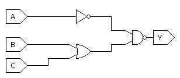
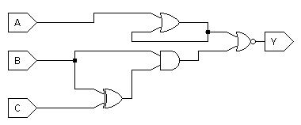
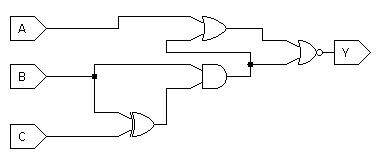

We will discuss some of these questions in class if time permits.
Otherwise, you can consider them extra, not-for-credit practice questions that
will help with understanding course material and studying for the exam.

No need to report the answers to me --
this is just for practice and will not be graded.
I will not be releasing answers for them,
but I am happy to discuss them in office hours if you want to review any of
them.

Note: some questions are taken entirely or in part from your textbook.

# General Questions

1. Consider the table below.
   For which basic gate is this the truth table?

   A   |   B | Y   |
   --- | --- | --- |
   0   |   0 | 0   |
   0   |   1 | 1   |
   1   |   0 | 1   |
   1   |   1 | 0   |

2. Draw a circuit with two one-bit inputs that outputs `True` if the inputs
   are equal and `False` otherwise.
   If you are able to do it,
   try to find more than one circuit that does the same thing --
   there is even a circuit consisting of just one gate that can do this.
   *Hint:* It may help to start by writing a truth table to describe the
   situation.

3. A combinational circuit is one in which the outputs depend only on the
   inputs.
   Try to come up with an example of a circuit that is *not* combinational.
   How would you demonstrate that it is not combinational?

4. How many rows are there in a truth table with 6 inputs?

5. The following truth table has two inputs and two outputs.
   (How can you tell by looking at the table that there are two outputs rather
   than three inputs?
   Think about your answer to the question above.)
   Draw the corresponding circuit.
   *Hint:* You can essentially draw separate circuits for Y and Z and connect
   the *inputs* of the circuits to each other.

   A | B | Y | Z |
   --- | --- | --- | --- |
   0 | 0 | 0 | 0 |
   0 | 1 | 1 | 1 |
   1 | 0 | 0 | 1 |
   1 | 1 | 1 | 0 |

6. It is possible for a truth table to have more than one input and/or more
   than one output.
   Does the number of entries in the table grow faster with the number of
   inputs, with the number of outputs, or the same with both?
   *Hint:* Consider your answers to the questions above.

7. Give one possible Boolean expression for the circuit above.

8. Write the truth table for the circuit above.

9. Write the truth table corresponding to `((A xor B) C)'`.

10. Draw the corresponding circuit from the previous question in the "natural"
   way.

11. For the two circuits above,
    determine whether or not each is combinational and explain why or why not.

12. I carry my umbrella only if it is raining outside.
    However, I *never* carry my umbrella if there is lightning.
    * Write a Boolean expression that describes whether I will carry my
      umbrella on a given day based on the weather
    * Draw the corresponding circuit
    * Write out the truth table

13. My dog will bark if I am not home and his favorite toy is out,
    or if I am home and his favorite toy is not out.
    Otherwise, my dog never barks.
    Describe this situation using a Boolean expression, a circuit,
    and a truth table.

14. Next up is a circuit with more than one output.
    I will buy a chocolate shake if I am hungry or if I just got paid.
    I will buy french fries only if I am hungry and I just got paid.
    Whether I buy a chocolate shake is completely independent of whether I buy
    french fries.
    Describe this situation using the tools from this course.

15. With your group members,
    try to create a few scenarios like the problems above and solve them.
    They don't need to be overly complicated.

<!-- Move to activity after SOP
10. Design a circuit that outputs "true" if a given day of the week (Sun-Sat)
    is part of the weekend (Saturday and Sunday only; not Friday).
    Otherwise, the circuit outputs "false".
    * Assume your circuit has 3 inputs
    * Monday is represented by the input triple `0 0 0`,
      Tuesday is `0 0 1`,
      Wednesday is `0 1 0`,
      Thursday is `0 1 1`,
      Friday is `1 0 0`,
      Saturday is `1 0 1`, and
      Sunday is `1 1 0`.
    * Given your answers to the two questions above, draw the circuit.
-->
