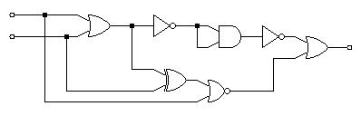
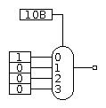

Note: some questions are taken entirely or in part from your textbook.

# General Questions

1. Consider 3 sports: javelin, soccer, and baseball.
Draw a circuit that determines whether a given sport requires a ball.
This needs to occur in two steps:
* Choose a representation for the sports that a circuit will understand.
There is no single correct representation,
though some might be easier to work with.
* Draw the circuit. Writing a truth table first may be helpful.
Your circuit can output either True or False if an invalid input is given --
i.e., don't worry about invalid inputs for this question



2. Assume all gates cause a delay of 10 nanoseconds.
What is the critical path through the circuit above?

3. Assume NOT gates cause a delay of just 3 nanoseconds,
but all other gates cause a delay of 10 nanoseconds.
Does that change the critical path through the circuit above?
Why or why not?

When answering the next few questions,
consider what you learned about **critical paths**.
This is an important concept that will show up throughout your career and daily
life if you know to look for it.

4. Building a house has the following (completely made-up) requirements:
* Pouring the foundation. Time cost: 2 weeks
* Building the framing, which requires a foundation. Time cost: 4 weeks
* Adding sideing, which requires a frame. Time cost: 1 week
* Adding a roof, which requires a frame. Time cost: 2 weeks
* Adding doors, which requires sideing. Time cost: 0.5 week
* Adding windows, which requires sideing. Time cost: 0.75 week
* Interior work, which requires a roof. Time cost: 4 weeks

How long does it take to build a house?

5. In the example above,
if the roof is delayed by one week,
how does this change the time for the overall project?

6. Are there any steps that can be delayed *without* causing the production of
the house to be delayed?
If so, list all of them.
If not, explain why not.

7. You are working on a group project and decide to split up tasks among
group members.
However, you have a group member who you are pretty sure will not finish
whatever tasks they are assigned in a timely manner.
How can the concept of a critical path help you in this situation?

8. Simplify the following Boolean algebra expressions:
* `A + (AB'C)`
* X'*(XYZ)'
* (XY)' + X
* A'BC + A'B'C + A'BC'

9. Write the truth table for a full adder.

10. Using full adders as black boxes,
draw a ripple-carry adder.

11. Consider a group of full adders making up a ripple-carry adder.
Assume all gates have a delay of 8 nanoseconds
If a full adder other than the first receives its carry-in at time 64,
at what point can we be sure that full adder has correctly produced
* its sum?
* its carry-out?

<!-- can't do anything below here today -->

12. Consider the following mux and inputs.
Note that the selector input is given in binary (hence the `B`).
What is the output?
How could you change the selector to get a different output?



<!-- ascii mux
```
    01
    |
   |-
 1-| \
 0-| |
 0-| |---
 0-| /
   |-

```
-->

13. Consider a circuit with two inputs: `Num` (two bits) and `DoNot` (one bit).
If `DoNot` is 0, the circuit outputs `Num`.
Otherwise, the circuit outputs the bitwise NOT of `Num`.
Create the circuit described using only muxes and NOT gates.

14. If `Num` were considered as a two's complement binary number,
would the circuit above compute `-Num` when `DoNot` was `1`?
Why or why not?

15. Represent the Boolean expression
`A + (B xor C)`
using only a multiplexor.

16. Consider representing the Boolean expression
`(A + B)*(C + ~A) + D + (E*F) + (F xor G)`
using a multiplexor.
    * how many selector inputs would be required?
    * how many data inputs?

17. Why might representing the expression above using a multiplexor be a bad
idea?
How does this relate to truth tables?

18. If it is both rainy and cold,
then I will carry an umbrella.
Otherwise, I will not carry an umbrella.
Design a circuit describing my behavior using only a multiplexor and no other
gates.

19. Design a circuit that takes in the current month as a number 0 - 11 and
outputs the next month.
* You may use an adder as a black box
* You may assume you have another black box called `lessThan`.
  This box may take two inputs of whatever size you choose and outputs `1` if
  its first input is less than its second input and `0` otherwise.
* Hint: a mux will be helpful here

20. Show that a 4:1 mux is logically complete.

21. Your lab partner wants to speed up your 16-bit adder using the following
idea:
   * use two 16-bit ripple-carry adders,
   one with a carry-in of 1 and the other with a carry-in of 0
   * attach the outputs to multiplexors and use the actual carry in as the
   selector for the muxes

How would you explain to them that this is a bad idea?
How could the idea be improved?

22. Consider a 4-bit carry-lookahead adder split into 2-bit blocks.
* How many full adders would this circuit use?
* What is the propogation delay of this circuit in terms of `T_FA` and `T_mux`?
* How does this correspond to the propogation delay of a 4-bit ripple-carry
  adder?
