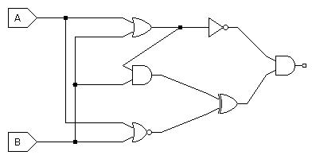
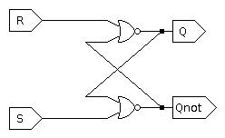
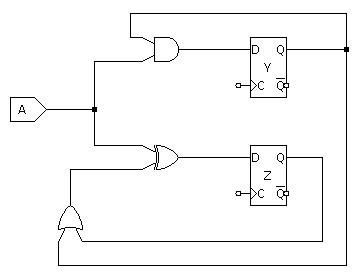

# General Questions

1. What relatively simple test can we perform to determine whether a circuit
   is combinational?

2. Is the following circuit combinational or sequential?

   

3. Is the following circuit combinational or sequential?

   

4. Describe in your own words the fundamental difference between combinational
   circuits and sequential circuits.
   (Hint: the answer is not "loops".
   Loops are how we *detect* a sequential circuit,
   but they are not a useful description of the underlying difference.)

5. Given the circuit below,
   try to create a truth table.
   (Hint: it will not be possible.
   The key is to see what happens when you try.)

   

6. Given what happened in the previous question,
   describe in your own words why it is not possible in general to represent
   sequential circuits using truth tables.

7. For each of the following applications,
   determine whether it could be modeled by a combinational circuit
   or whether a sequential circuit would be required and explain *why*.
   * Each day, a student enters the number of pages they have read that day.
     The circuit then outputs the total number of pages the student has read
     that semester.
   * A customer enters all of the toppings that will go on a pizza and the
     circuit outputs the price of the pizza.
   * Each time a user makes a credit card transaction or payment,
     the circuit outputs the current balance of the credit card.

8. Can all sequential circuits be described with Boolean algebra?
   If not, can you come up with an example of why this does not work?
   (Hint: think about the relationship we have discussed between Boolean
   algebra and truth tables.)

9. Why must an SR latch be analyzed until it converges,
   which may take several iterations through the circuit,
   whereas an adder does not need to be analyzed through multiple iterations?

10. Create a characteristic table for the circuit below.
    (Hint: the circuit has just one input, but has two bits of state.)

    

11. When filling out the characteristic table for the SR latch in lecture,
    we assumed that the outputs `Q` and `Qnot` always started as opposites.
    How can we force the circuit into a state where that is not the case?

12. Consider the two diagrams below.
    The first is the standard SR latch.
    The second is wired the same, but with the `Qnot` output removed.
    Will the circuit in the second diagram behave the same as the circuit in
    the first diagram?

    

    

13. Consider the diagram below.
    Is the circuit in this diagram an SR latch?
    That is, if we treated it as a black box and considered only its inputs and
    outputs,
    would it behave the same way as the circuit we have been studying?
    (Hint: how can we characterize the behavior of a sequential circuit?)

    

14. The output of a D latch is currently 0.
    Describe what must be done to make the output 1.

15. Assume the input to a latch is controlled by combinational logic that takes
    40 ns to reach a steady state from when its own inputs are updated.
    During that time, its output(s) may glitch.
    Why is this a problem for an SR latch?
    How can a D latch handle this problem?

16. Design a timing diagram
    (a view of the input `D` and the clock over time)
    for which a D latch and a D flip-flop behave very differently.

Here, we are switching gears to synchronous sequential circuits.
First, though, we are going to create a combinational circuit,
because creating a combinational circuit is often a good first step to
creating a synchronous sequential circuit.

17. Create a circuit that takes two inputs, `A` and `B`.
    If `A` is `0`,
    then the circuit outputs `NOT B`.
    Otherwise, the circuit outputs `B`.
    You can fill out a truth table and create the sum-of-products circuit,
    but there is a simpler way to create this circuit.

18. Create a circuit that stores one bit of state and takes one input.
    At the rising edge of the clock, this circuit will
    * flip its stored bit (i.e., `NOT` the bit) if the input is `0`
    * keep its stored bit if the input is `1`

    Note the similarity between this circuit and the circuit you created above.
    It should be possible to create this circuit with minimal modifications
    to the circuit above.

    You may use a D flip-flop as a black box.

19. Consider the following characteristic table:

    A   | B   | X   | Xnext
    --- | --- | --- | --- |
    0   | 0   | 0   | 0
    0   | 0   | 1   | 0
    0   | 1   | 0   | 1
    0   | 1   | 1   | 0
    1   | 0   | 0   | 1
    1   | 0   | 1   | 0
    1   | 1   | 0   | 0
    1   | 1   | 1   | 0

    Draw a synchronous sequential circuit that has this characteristic table.
    *Hint:* If you are not sure where to start,
    pretend that `X` has nothing to do with `Xnext`.
    That is, assume it is just an input `C`.
    Then, draw the corresponding combinational circuit.
    From there, it is a small change to make the circuit synchronous sequential.

20. Consider the following characteristic table:

    A | X | Y | Xnext | Ynext
    --- | --- | --- | --- | --- |
    0 | 0 | 0 | 0 | 0
    0 | 0 | 1 | 0 | 0
    0 | 1 | 0 | 1 | 0
    0 | 1 | 1 | 1 | 0
    1 | 0 | 0 | 1 | 1
    1 | 0 | 1 | 1 | 1
    1 | 1 | 0 | 0 | 1
    1 | 1 | 1 | 0 | 0

    Draw a synchronous sequential circuit that has this characteristic table.
    The same hint as above applies here, but with both bits of state.

21. If you are in the morning section, you can skip this question
    (or, if you have extra time after completing the remaining problems,
    design this circuit for additional practice).
    For the afternoon section, this was the original question 17.

    A | X | Y | Xnext | Ynext
    --- | --- | --- | --- | --- |
    0 | 0 | 0 | 1 | 0
    0 | 0 | 1 | 0 | 1
    0 | 1 | 0 | 0 | 1
    0 | 1 | 1 | 0 | 0
    1 | 0 | 0 | 0 | 1
    1 | 0 | 1 | 0 | 1
    1 | 1 | 0 | 1 | 0
    1 | 1 | 1 | 0 | 0

    Draw a synchronous sequential circuit that has this characteristic table.

22. Afternoon section only --
    consider a circuit corresponding to the table above
    (question 21).
    Draw the timing diagram for the circuit in the following scenario.

    * The initial inputs and state are `(0, 0, 0)`
    * The value of `A` is held fixed at `0` for the first three clock ticks,
      then switches to `1`

22. Morning section only --
    consider a circuit corresponding to the table above
    (question 20).
    Draw the timing diagram for the circuit in the following scenario.

    * The initial inputs and state are `(1, 0, 1)`
    * The value of `A` is held fixed at `1` for the first three clock ticks,
      then switches to `0`

23. Create a characteristic table for the circuit pictured below.

    

24. Consider the following scenario.
    A golfer will hit a good shot if it is sunny and there is no wind.
    They will hit a bad shot any time there is wind.
    If it is not sunny and there is no wind,
    then the golfer will continue to play how they have been --
    if their previous shot was bad,
    their next shot will be bad,
    and if their previous shot was good,
    their next shot will be good.

    Draw a characteristic table describing the golfer's behavior.

25. Draw a circuit corresponding to the situation above.

26. Choose some initial state and some values for the inputs and draw a timing
    diagram for the golfer's behavior.
