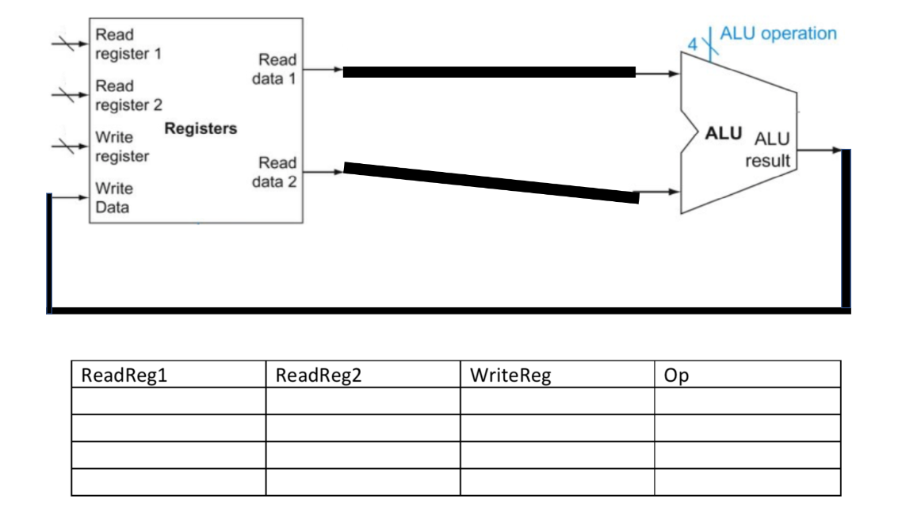
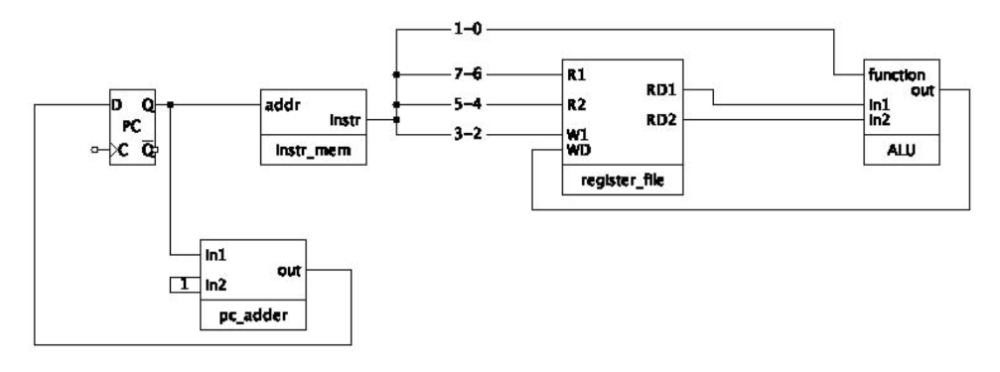
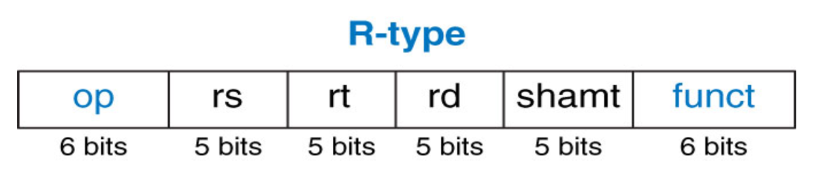
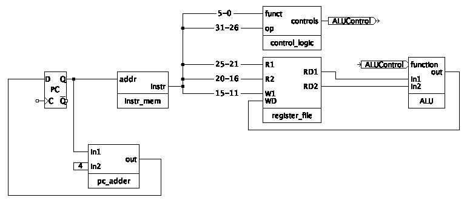

# General Questions

For the next few questions,
consider the hypothetical "computer" below.



Assume the following table holds the operation codes (in decimal) for the
ALU.

   Operation | Code |
   ---       | ---  |
   add       |   0  |
   sub       |   1  |
   slt       |   2  |
   and       |   3  |

1. Assuming the register file holds 8 registers and the can ALU can perform
   only those 4 operations,
   how many bits are required in each column of the table?

2. Using the table, write a binary program for the CPU that checks whether
   `a + b + c < d`, where `a`, `b`, `c`, and `d` are stored in
   registers 2, 5, 6, and 7, respectively.
   Store the result in register 1.

3. Write your above program in assembly language.

4. Assuming the same register-value pairs as the previous problem,
   write a binary program that checks whether `d` is the largest of the 4
   numbers.
   (Hint: you do not need to use subtraction here.)

5. If we wanted to add an instruction for the above "computer" that added up
   three numbers at once and stored the result in another register,
   would the require changing
   * the architecture?
   * the microarchitecture?

Next, consider the hypothetical computer with the one-byte datapath that
we discussed in lecture, pictured below.
Note that this computer has just four registers.



Assume the operation codes for the ALU are the same as given above and that
the instruction memory currently holds the following values:

   location | value    |
   ---      | ---      |
   00000000 | 00001000 |
   00000001 | 10111000 |
   00000010 | 00000010 |
   00000011 | 11100011 |

6. If the program counter is currently 2 (in decimal),
   * what is the binary value of the current instruction?
   * what is the binary value of the next instruction?

7. Assuming the program counter is currently 3,
   what is the assembly instruction being run
   (the human-readable assembly code, not the binary value)?

8. Assuming the program counter is currently 3,
   what is the two-bit value going into the `R1` input of the register file?
   What does it represent?
   (I.e., what does that value "mean" to us,
   or what purpose does it serve in this instruction?)

9. Assuming the program counter is currently 0,
   do we have enough information to say what output `RD1` of the register file
   is?
   * If so, give the value.
     If not, explain why not.
   * In either case, explain what the value represents.

10. For this question,
    assume we are running on a different computer with a different instruction
    format.
    This format uses 4 bits to specify which register is the destination of an
    operation.
    * Can we tell how many registers the architecture has?
    * Can we tell how many bytes each register stores?

11. Consider the following sentence:
    "The program counter register holds the current instruction."
    Explain why the sentence is incorrect or, at the very least, imprecise.

Next, let's switch gears to the actual MIPS architecture.
The format for R-type instructions is given below.



12. Give a few examples of R-type instructions.

13. Looking only at the instruction format and disregarding anything else you
    know about MIPS,
    is it possible to determine how many registers MIPS uses?
    * If so, how many are there?
    * If not, explain why not.

14. Recall from lecture that every R-type instruction has an opcode of `0`.
    * Given a binary instruction,
      how can a machine tell *which* R-type instruction you want to run?
    * What is the largest possible number of distinct R-type instructions in
      MIPS?

<!--
2. Is there anything that can be done in a high-level language (e.g., Java)
that cannot be done in assembly?
If so, give an example.
If not, explain why not.

4. MIPS instructions are stored as 32-bit numbers.
What is the advantage of having every instruction stored using the same
number of bits?
Are there any disadvantages?
-->

For the next few questions,
you will likely want to use a
[website listing MIPS opcodes and function codes](https://uweb.engr.arizona.edu/~ece369/Resources/spim/MIPSReference.pdf).
This link also has generally helpful reference information about MIPS
instructions.

15. Convert the following R-type instruction from machine code to
    assembly:
    ```
    0x012E4022
    ```
    You can use a hex to binary converter if you find it helpful.
    But, do not simply use an online tool to answer the entire question.
    * How could you have known the instruction was R-type if I did not tell
      you?

Consider the MIPS R-type datapath from lecture, copied below.



16. Try to pick out any differences between this diagram and the one above for
    the simplified computer.
    Explain why those differences exist or what they tell us about the
    different architectures being implemented.

17. Find the bus between `RD1` on the register file and `In1` on the ALU.
    Then, find the bus going into `R1` on the register file.
    Do they have the same width (i.e., same number of bits)?
    Why or why not?

18. You decide you want a button on your computer that makes it skip every
    other instruction
    (or, in other words, advance by two instructions)
    for as long as you are holding the button.
    Assume this button is represented as a one-bit input pin named `button`
    on the diagram.

    Where and how would you hook up this input pin in the diagram,
    possibly with some additional gates,
    in order to accomplish what you want?
    * Hint: if you aren't sure how to get started,
      try to figure out roughly which section of the circuit you
      would be modifying and/or which existing components would be involved.

<!--
15. We have seen that computer instructions are really just numbers.
Explain in your own words how we can use this fact to make a computer that runs
automatically.
-->

19. We may not have discussed this kind of instruction in assembly yet,
    but can you think of any reason why it would be helpful for the computer
    to sometimes move to a different instruction rather than proceeding to the
    one directly after it in memory?
    Try to think of a case where something like this happens in high-level
    (non-assembly) code.

20. For each of the following I-type instructions,
    indicate whether the immediate is signed or unsigned.
    * `addi`
    * `andi`
    * `xori`
    * `slti`
    * `beq`

21. Explain why knowing the opcode is sufficient to identify a particular
    I-type instruction but insufficient to identify a particular R-type
    instruction.
