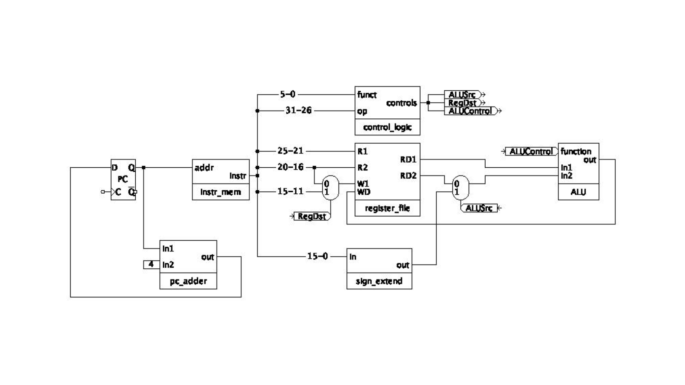
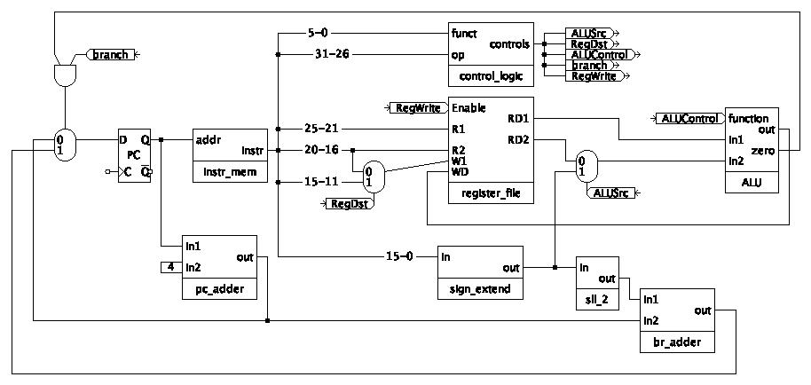

# General Questions

Consider the datapath we implemented for R-type and (some) I-type
instructions, pictured below.



1. Explain, in general terms,
   how a single circuit is able to handle different instruction types.
   Or, put another way,
   if you were asked to add circuitry for a new instruction type,
   how would you go about it in general?

2. Consider the purpose of the `RegDst` control wire and the mux it controls.
   (To see what purpose a mux serves,
   it can be helpful to look both at where its inputs come from and where its
   output is going.)
   What is the value of `RegDst` when the instruction is `addi`?

   Note: the value of a control wire is *not* something you should
   simply memorize or look up in a table.
   Try to understand *why* `RegDst` takes a particular value for a particular
   instruction.

3. Next, perform the same analysis for `ALUSrc`.
   What is the value `ALUSrc` when the instruction is `addi`?

4. Assume the current instruction is
   `addi $14, $15, 8`.
   Without converting the instruction to binary,
   determine what the `R1` input to the register file is for this instruction.

5. In the datapath above,
   write in the values on as many of the wires as possible for the instruction
   `addi $14, $15, 8`.
   What additional information would you need to completely fill out the diagram?

6. Explain the purpose of the wire above with bits `15-11`
   (the one going into entry `1` of the first mux).
   Which instructions ignore this wire
   (i.e., for which instructions is the value on that wire unimportant or
   meaningless)?

7. We will learn how to build the control logic later.
   Do you expect that the control logic will implemented with a combinational or a
   sequential circuit?
   Why?

For the next few questions, consider the following code snippet:
```
   addi $t0, $0, 2
   addi $t1, $0, 4
   addi $s0, $0, 0

   sll $t2, $t0, 1
   beq $t1, $t2, L1
   addi $s0, $s0, 8

L1:
   beq $t0, $t1, L2
   addi $s0, $s0, 4

L2:
   addi $s0, $s0, 2
```

8. What is the value in `$s0` when the code finishes?

9. Write high-level code that corresponds to the assembly code above.

10. What are the values of the immediates stored in the two branch
    instructions?
    Look up PC-relative addressing in the branching slides if you are unsure
    where to start.

11. Write the machine code for each of the branch instructions above.

12. You are designing a new MIPS-like 32-bit architecture.
    However, you want your architecture to have 64 registers.
    Design an R-type instruction for this architecture.
    What decisions/compromises do you need to make in your design?

11. Why does a jump instruction need to store the address in a "funny" way?
    Why not just encode the entire address in the instruction?

12. What is the value of the immediate stored in the jump instruction in the
    following code snippet?
    ```
    0x00400000 |       j place
    0x00400004 |       addi $t0, $0, 1
    0x00400008 |       addi $t1, $0, 2
    0x0040000C |       and $t2, $t0, $t1
    0x00400010 | place: or $t3, $t0, $t1
    0x00400014 |       xor $t4, $t0, $t1
    ```

13. From a given location in the code,
    are there addresses that
    * a `j` instruction can jump to that a `beq` instruction cannot reach?
    * a `beq` instruction can branch to that a `j` instruction cannot reach?

    Explain why or why not.

For the next few questions, consider the following diagram.



14. How many bits does the bus from the `zero` output of the ALU carry?
    What value is output from `zero` in each of the following instructions?
    * `addi $t1, $0, 7`
    * `sub $t3, $t2, $t2`

15. Explain the purpose of the new mux to the left of the program counter.
    Under what conditions does the selector to that mux have a value of `1`?

16. Your lab partner claims that the value of the `RegDst` control wire does
    not matter if the current instruction is `beq`.
    Are they correct? Why or why not?

17. Where does the second input to the ALU (`In2`) come from in a `beq`
    instruction?
    Why do we need that value?

18. If the sign-extender were replaced with a zero-extender,
    how would it affect (if at all) the following instructions:
    * addi?
    * add?
    * branch?

19. If the `sll_2` shifted by 3 instead of 2,
    what would instruction(s) would the change affect?
    How would it change them?
    Give any upsides or downsides.

20. Modify the circuit to include a `bne` instruction as well as a `beq`
    instruction.
    You may add new control wires if needed.
    (Hint: remember our general process for adding new instructions.)

21. Give an example of an instruction that would not work if the `RegWrite`
    flag were not present
    (i.e., if the register file were always writable).

22. Open up the
[assembly and memory handout](/misc/assembly-and-memory.pdf)
and work through as much as you can.

<!--
22. As a first step toward moving to a 64-bit architecture,
    the designers of MIPS decide to move to 64-bit instructions that simply
    include padding (`0`s) as the last 32 bits and leave everything else about
    the instruction formats the same.
    What change(s) would need to be made to the diagram to support this new
    format?
    (Hint: It's not much.)

23. Why is this not a valid MIPS instruction: `addi $t0, $t1, 65500`?

24. If I want to get the number `0x03510000` into a register,
    how can I do that in three instructions or fewer in MIPS?

25. If I want to get the number `0x03510452` into a register,
    how can I do that in three instructions or fewer in MIPS?

26. If you wanted to get the effect of the instruction from (22) in MIPS,
    how could you go about it?
    (It may take more than one instruction.)

27. We usually consider `$rt` to be the destination register for I-type
    instructions.
    Give an example of an I-type instruction for which this is not an accurate
    description of `$rt`.

28. The address of the first line of code below is `0x0004080`.
    What is the address of the line marked `A`?
    ```
    beq $7 $8 gohere
    addi $19 $19 2
    gohere:
    sub $19 $8 $7  # A
    j goelsewhere
    ```

29. The current value of `$PC` is `0x000498c`.
    If the current instruction is a jump instruction,
    is there anywhere it *cannot* jump to?

30. Consider an architecture that has just one branch instruction --
    branch-if-equal-to-zero (`beqz`).
    This instruction takes just one register and a label and branches if the
    contents of the register are zero.
    How could you write the following conditionals using just that type of
    branch statement?
    (You will likely need other assembly statements before your branch
    statement.)

    **Snippet 1**
    ```
    if a != 5:
      a = 6
    ... # do stuff
    ```

    **Snippet 2**
    ```
    if a > 5:
      a = 6
    ... # do stuff
    ```

31. For both jump instructions and both branch instructions below,
what is the value of `place`
(i.e., what value is actually encoded in the instruction itself)?
```
0x00400000 |       j place
0x00400004 |       j place
0x00400008 |       beq $t1, $0, place
0x0040000C |       beq $s1, $s2, place
0x00400010 | place: or $t3, $t0, $t1
0x00400014 |       xor $t4, $t0, $t1
```
-->
