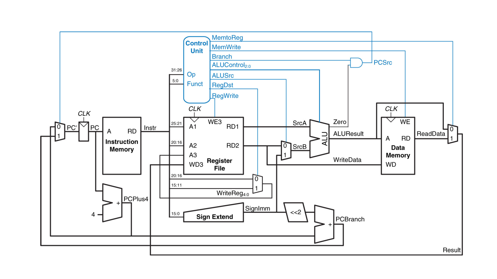

# General Questions

For the first few questions, consider the instruction `lw $t0, 4($s1)`.

1. What is the memory address that is being read and where is the data from
   that address being written?

2. Are there any restrictions on the value in `$s1` for this instruction to
   run successfully?

For the next few questions,
consider the MIPS microarchitecture from your textbook.

   

3. Consider the instruction `lw $s0, 4($t0)`.
   In words, what is the value on the `ALUResult` line for this instruction?
   You do not need to go through the entire diagram to figure this out.
   Consider that one wire, and ask yourself where it is coming from
   (i.e., what is the job of the ALU in a `lw` instruction)
   or where it is going
   (i.e., what is the `A` input of `Data Memory` for a `lw` instruction).

4. Consider the instruction `lw $s0, 4($t0)` again.
   Does the `WriteData` line have any *useful* data on it for this instruction?
   How do you know?
   If so, describe where the data comes from.
   If not, try to figure out what non-useful data would be on that wire.

5. Consider the instruction `sw $s0, 4($t1)`.
   For each of the following parts of the circuit,
   decide whether it is useful or not useful for this instruction:
   * the ALU
   * the sign extender
   * the left-shifter (denoted `<<2`)
   * the mux with `MemtoReg` as its control line

6. Circle or highlight the parts of the circuit responsible for moving from
   one instruction to the next assuming we are *not* branching or jumping.

7. What is the value of `MemtoReg` for each of the following instructions?
   Write an `X` if the value does not matter.
   * `lw`
   * `add`
   * `addi`
   * `bne`

8. The instructions above have the following opcodes:
   * `lw` -- `100011`
   * `add` -- `000000`
   * `addi` -- `001000`
   * `bne` -- `000101`

   Assuming those were the only instructions implemented,
   give an example of how the control logic for `MemtoReg` could look.
   Assume that any `X` above is treated as a `0`
   (though this is not necessarily the case in a real circuit.)

   If you are having trouble knowing where to start,
   bear in mind the following things:
   * this is just combinational circuit design --
     use any tools you know related to that
   * carefully consider what the inputs and outputs are for the combinational
     circuit you are designing
   * your answer the the previous question will be very relevant to this one

For the next few questions,
we are going to consider how the clock affects the microarchitecture.
Note that any specific times given in the questions are made up and may not
even reflect the relative order of time delay of the various circuit
components.

9. Which elements in the diagram above are connected to a clock?
   For each element you list, explain why it must be connected to the clock
   (or, in other words, what would go wrong if the element were not connected
   to the clock?)

10. Consider a `lw` instruction.
    Assume it takes
    * 10 nanoseconds total to read from registers and compute a sum
    * 20 nanoseconds to read from memory
    * 5 nanoseconds to write a value to a register
    * 10 nanoseconds to compute `PC + 4`

    How long must the clock period be for the circuit to run `lw` safely?
    (Hint: Remember the idea of a *critical path* --
    not everything listed above is necessarily relevant.)

11. Consider an `add` instruction,
    and make the same assumptions about timings as given above.
    How long must the clock period be for the circuit to run `add` safely
    (disregarding `lw`)?

12. Given your answers to the previous two questions,
    what must the clock period be set to in order for the circuit to run
    correctly given that it implements both instructions?

13. If computing a branch target takes 15 nanoseconds total,
    does including the `beq` instruction
    * increase the required clock period,
    * decrease the required clock period, or
    * not affect the required clock period
    given that `add` and `lw` are both implemented?

For the next few questions,
consider the array `[7, 99, 14, 12]` with base address `0x10004000`
as pictured below.

```
addr       | data
---        | ---
0x10004014 |   X
0x10004010 |   X
0x1000400c |  12
0x10004008 |  14
0x10004004 |  99
0x10004000 |   7
```

14. Assume the base address is loaded into `$t4`.
    Write assembly code demonstrating two ways you could access `array[2]` in
    MIPS.
    *Hint*: One of the ways will require just one command,
    and the other will require more.

15. Assume the base address is loaded into `$t4`.
    Write assembly code to store the value 24 in `array[3]`.
    There are several ways to accomplish this.

16. Consider the code below.
    You do not need to particularly worry about what the function does
    (it's nothing generally useful).
    ```
    addi $a0, $0, 1
    addi $a1, $0, 5
    addi $s0, $0, 7
    addi $s1, $0, 12
    # Point A
    jal fun
    # Point C

    ...

    fun:
        addi $sp, $sp, -8
        sw $s0, 0($sp)
        sw $s1, 4($sp)

        addi $s0, $a0, 2
        addi $s1, $a1, 1

        # Point B

        sub $v0, $s0, $s1

        lw $s1, 4($sp)
        lw $s0, 0($sp)
        addi $sp, $sp, 8
        jr $ra
    ```

    Assume the stack pointer starts at `$sp = 0x6FFFFFFC`.
    In the diagram below,
    fill in the contents of memory at the three marked points in the code.
    If the contents are unknown, simply enter an `X`.

    Note that in the diagram,
    "memory location" means "the word starting at memory location."
    ```
    | memory location | A    | B    | C    |
    |  0x6FFFFFFC     |      |      |      |
    |  0x6FFFFFF8     |      |      |      |
    |  0x6FFFFFF4     |      |      |      |
    |  0x6FFFFFF0     |      |      |      |
    |  0x6FFFFFEC     |      |      |      |
    |  0x6FFFFFE8     |      |      |      |
    |  0x6FFFFFE4     |      |      |      |
    |  0x6FFFFFE0     |      |      |      |
    ```

17. The following function does not preserve registers correctly.
    Modify it so that it does.

    ```
    fun:
        addi $s0, $0, 8
        addi $t1, $0, 4

        slt $t4, $a0, $s0
        slt $t5, $t1, $a0
        and $v0, $t4, $t5

        jr $ra
    ```
<!--
9. Would writing general functions be possible without the `jal` instruction?
   If not, explain why not. If so, explain how.

10. The function `bar` is intended to add up the results of three other function
    calls.
    The code does not work correctly.
    It results in an infinite loop (among other problems).
    Why?

    ```
    bar:
        li $s0, 0
        jal fun1
        add $s0, $s0, $v0
        jal fun2
        add $s0, $s0, $v0
        jal fun3
        add $v0, $s0, $v0
        jr $ra
    ```

11. Would the following function implementation and corresponding call work
    correctly?
    If not, why not?
    If so, is it a good implementation?

    ```
        addi $t0, $0, 4
        addi $t1, $0, 8
        jal sum            # sum(4, 8)
        ...

    sum:
        add $v0, $t0, $t1
        jr $ra
    ```

12. The following code does not work.
    Why? What would happen if it were run?
    (Note that the comments explain what the code is *supposed* to do,
    not necessarily what it actually does.)

    ```
        # array entries are [1, 3, 9, 12, 15]
        # s0: base address of array
        # t0: constant 10
        # t4: accumulator
        addi $t0, $0, 10
        addi $t4, $0, 0

        lw $t1, 0($s0)

    loop:                    # loop while array entry < 10
        slt $t2, $t1, $t0
        beq $t2, $0, done
        add $t4, $t4, $t1    # $t4 += $t1
        addi $s0, $s0, 4     # move to next array entry
        j loop
    done:
    ```
-->
