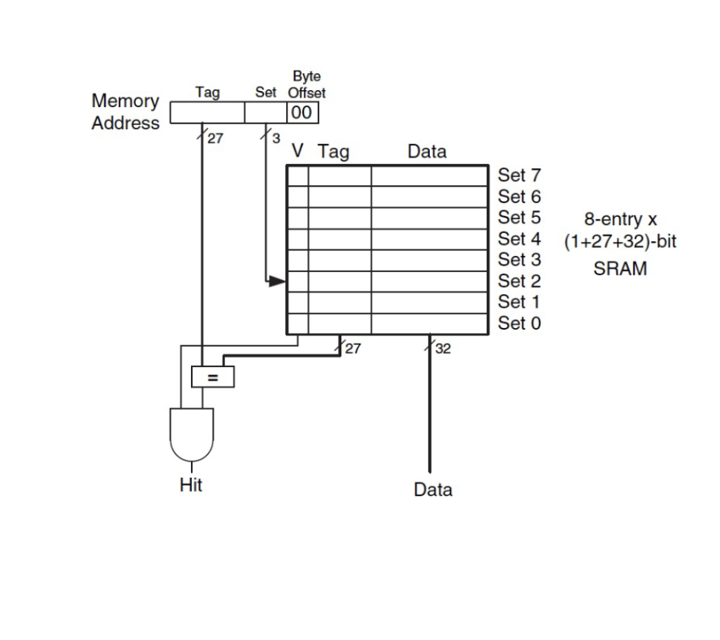
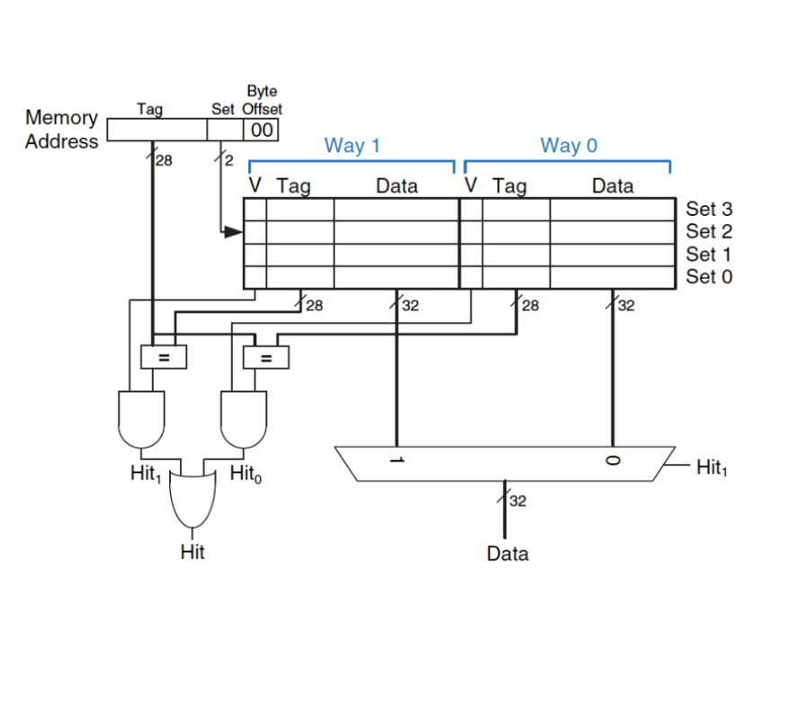

# General Questions

1. What is a *conflict* in the context of caches?
   Can it occur if the cache is not full?
   Why or why not?

2. Consider the image of a cache below (taken from your textbook):
   

   Why is it called a "(1 + 27 + 32)-bit SRAM"?
   (I am asking about the numbers, not the SRAM part.)

3. Consider the image of a cache below (taken from your textbook):
   

   What would happen if the mux were broken so that the control wire were
   always set to `1`?

4. In the same image,
   What would happen if the `=` box leading to `Hit1` were broken?
   Would it be better if the broken box always output `1` or always output `0`?
   Why?

For the next few questions,
consider the skeleton code below.

```
        addi $t0, $0, 5
loop:   beq $t0, $0, done
        lw $t1, XXX($0)
        lw $t2, XXX($0)
        addi $t0, $0, -1
        j loop
```

Assume that you are working with a cache that contains 8 sets and that uses
a block size of 1 word (i.e., 4 bytes).

5. Replace the `XXX` with specific values that cause a direct-mapped cache
   to perform much *worse* than a 2-way associative cache of the same size.
   (Hint: Try to cause conflicts in the direct-mapped cache.)

6. Is it possible to make the two-way associative cache perform worse in this
   case?
   Why or why not?

<!--
7. Associative caches generally reduce the number of conflicts that occur
   *even when they do not change the overall amount of information stored*.
   Can you think of an intuitive reason why?
-->

7. LRU (least-recently used) is an example of a replacement policy that could
   be used in an associative cache.
   Why does it not make sense to have a replacement policy for a direct-mapped
   cache?
   (It may be helpful to consider how you would describe in your own words what
   a replacement policy does -- it's purpose.)

8. What big-picture idea that we have discussed in the context of caches would
   tell us that LRU is a good idea for a replacement policy?
   (Hint: what properties of data accesses make caches a good idea in the first
   place?)

9. Give an advantage of pseudo-LRU over LRU.
   Does the advantage grow or shrink as the cache becomes more associative?

10. Which of the following would be most useful in exploiting spatial locality
    of data accesses?
    * increasing cache size
    * increasing block size
    * increasing associativity

<!--
11. Work through the questions in the
    [caches and associativity handout](/handouts/associative-cache-handout.pdf)

12. Try the not-for-credit cache activities posted to PL.
    Repeat them a few times until you are comfortable.
-->
