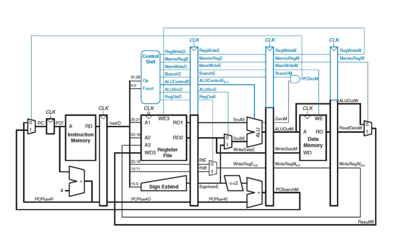

# General Questions

1. Consider wrapping Christmas presents with two friends.
   To wrap a present,
   you need to cut the paper to the correct size,
   fold it around the present,
   and then tape the paper on.

   If you have many presents to wrap but only one pair of scissors and one
   roll of tape,
   explain the three of you could work together to get the presents wrapped
   faster.

2. In the above scenario,
   would you be able to wrap presents three times as quickly as one of you
   could individually?
   Why or why not?

3. Assuming it takes 10 seconds to cut, 5 seconds to wrap, and 30 seconds to
   tape,
   how long will it take you to wrap 1 present?
   5 presents?
   (For this question,
   assume the time to hand the present from one person to the next can be
   ignored.)
   It will likely be very helpful to draw a diagram like the ones used in
   lecture to help figure out the time.

<!--
4. If instead it takes 10 seconds to cut, 30 seconds to wrap,
   and 5 seconds to tape,
   does this change the total time to wrap 1 present?
   5 presents?
-->

4. Consider the same scenario,
   except you have three pairs of scissors,
   three rolls of paper,
   and three tape holders.
   Could you be more efficient in this case?
   (Hint: consider alternative forms of parallelism.)

5. Next, let's go back to the scenario where you have just one set of
   materials (one pair of scissors, etc.).
   One difference between the present-wrapping situation we have been
   considering and a pipelined processor is that we have not had a "clock"
   in the present-wrapping scenario to control when presents move through
   the stages.
   If we somehow added a clock
   (for example, by saying that presents could only be passed when a timer went
   off)
   how would that change the timing for wrapping
   * one present?
   * hundreds of presents?
     (Hint: don't actually find the time required to wrap 100 presents.
     Instead, think about the long-term pattern you would observe in terms of
     pipelining.)

   If you drew a diagram to help answer the above question,
   it may be insightful to figure out how the diagram would change.

6. Come up with a real-life example of pipelining that you might see
   (it doesn't need to be anything practical,
   though you might be surprised how often the idea can come up).
   Discuss with your groupmates and explain why it is a pipeline,
   how well it would increase throughput,
   and so on.

7. The processor above is split into five stages.
   Ideally, how would this change
   * the latency?
   * the throughput?

   In practice, give one or two reasons why the throughput will not be improved
   by the ideal amount.

For the next few questions,
consider either or both of the images above.

8. For each cycle (1 through 10),
   state how many instructions are in the pipeline during that cycle.

9. During cycle 5,
   which instruction is in the Execute stage?
   (If you do not remember which part is the Execute stage,
   ask me or check your notes.)

10. Given your previous answer,
    explain in more detail what is happening in the Execute stage of the
    pipeline during cycle 5.
    For example,
    what are the operands to the ALU?
    How are the control wires for that stage set?
    And so on.

    You may want to think back to previous homeworks on microarchitecture to
    answer this one.

11. During cycle 6 of the above image,
    what is happening in the Fetch stage?

12. With a five-stage pipeline,
    how many instructions can the processor complete
    * in the first 8 cycles?
      (Hint: you can use the image above for this if you are not sure.)
    * in the first 70 cycles?
      (You probably don't want to draw this entire picture --
      look for a pattern.)

13. With a five-stage pipeline and a clock cycle of 200 ps,
    what is the long-term throughput of the processor?

14. Imagine if the control signals were not pipelined along with the rest of
    the instruction.
    Instead, whatever is currently in the decode stage determines the control
    signals throughout the ciruit.
    What could go wrong if you have an `add` instruction in the Memory stage
    and a `sw` instruction in the Decode stage?

15. Consider the same scenario,
    but you now have an `add` instruction in the Execute stage
    and an `addi` instruction in the Decode stage.

16. According to the textbook,
    the Fetch and Memory stages are the slowest stages of the pipeline.
    If we were to slow down the ALU slightly,
    would this affect the throughput of the processor?
    Why or why not?

17. The pipelined MIPS process we learned about in lecture has 5 stages.
    If we added a 6th stage,
    would throughput be improved?
    Why or why not?
    (Hint: if you're not sure about this one,
    think about what determines the long-term throughput of the processor.)

    What about latency?
