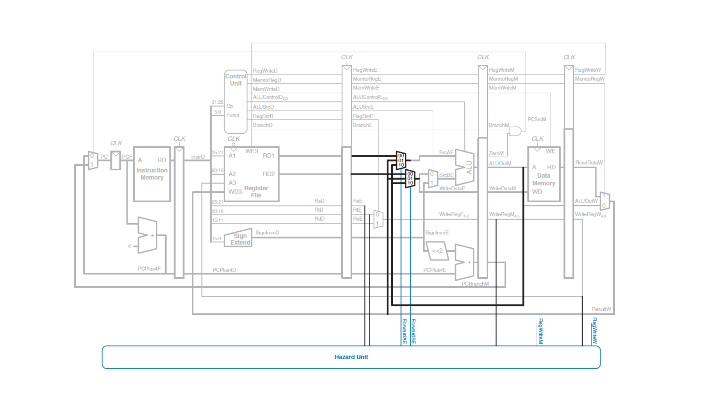
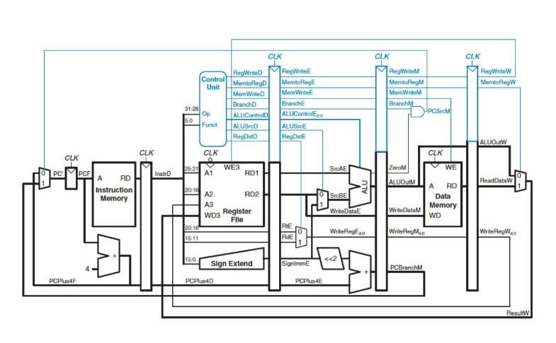
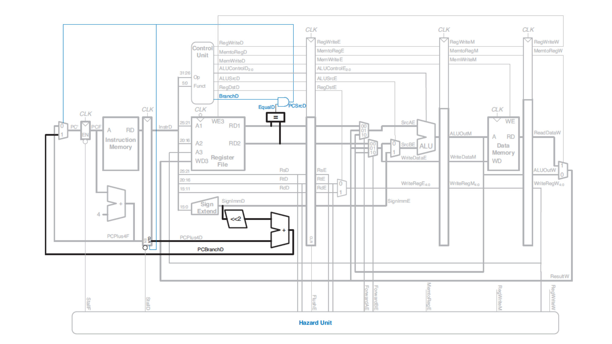

# General Questions

1. Consider the two code snippets below.
   Assume they are run independently of one another.
   For each snippet,
   determine whether it would require a stall to operate correctly and explain
   why or why not.
   ```
   # A
   sub $s0 $s3 $t0
   add $t1 $s0 $s0
   and $s2 $t1 $t1
   ```

   ```
   # B
   ori $t7 $0 15
   lw $t6 1($t7)
   addi $s4 $t6 $t7
   ```

2. The code below contains a data hazard that will result in a stall.
   Identify the hazard.
   Which instructions will end up spending more than 5 cycles in the pipeline
   due to the stall?
   ```
   # $t0 holds the value 50
   # $t1 holds the value 40
   add $t0 $t0 $t2
   lw $t1 4($t0)
   slt $t2 $t0 $t1
   or $s1 $s2 $s3
   and $s4 $s6 $s5
   slti $s4 $s4 0
   # ... code continues
   ```

3. Draw a pipeline diagram
   (the one that runs in a stair-step pattern with cycles along the horizontal
   axis and instructions along the vertical axis)
   showing how the previous instructions go through the pipeline.
   When data forwarding occurs,
   indicate it by drawing an arrow showing where the information is forwarded
   from and to.
   (Hint: the arrows should always be vertical.)



4. The third instruction below needs to have one of its operands forwarded
   from a previous instruction.
   In the image above,
   highlight the part of the data path showing how the forwarding happens for
   that particular instruction.
   ```
   add $t0 $t1 $t2
   add $s0 $s1 $s2
   add $t0 $t0 $t2
   ```

5. For each instruction below,
   determine where the operands to the ALU will come from during that
   instruction's Execute stage
   (i.e., determine `ForwardAE` and `ForwardBE` in the diagram above).
   ```
   add $t0 $t1 $t2
   slt $t2 $t0 $t1
   or $s1 $s2 $t0
   and $s4 $s6 $t0
   lw $t1 4($s4)
   slti $s6 $t1 0
   ```



6. Consider the image above.
   In which stage is the decision about whether to branch made in this version
   of the CPU?
   For how many instructions would the pipeline need to stall if it did not
   perform branch prediction?
   If the processor did perform branch prediction,
   what would be the corresponding branch misdirection penalty
   (i.e., how many cycles are wasted if we "guess wrong" about whether to
   branch)?



7. Consider the image above.
   In which stage is the decision about whether to branch made in this version
   of the CPU?
   For how many instructions would the pipeline need to stall if it did not
   perform branch prediction?
   If the processor did perform branch prediction,
   what would be the corresponding branch misdirection penalty
   (i.e., how many cycles are wasted if we "guess wrong" about whether to
   branch)?

8. Consider a pipelined CPU where the branch prediction was not made until the
   Writeback stage.
   Such a processor could not safely use branch prediction --
   it would need to stall until the decision about whether to branch had been
   made.
   This is because if the processor tried to perform branch prediction,
   it might change program state
   (contents of memory or registers)
   in an undesirable way.
   Why might this occur?
   (Hint: consider in which stages we change the contents of memory or
   registers.)

9. Consider the following code snippet:
   ```
   beq $0 $0 foo
   addi $t0 $t0 1
   foo:
   add $v0 $0 $t0
   ...
   ```
   What is the next instruction that should occur after the `beq`?
   If a pipelined processor is using branch prediction,
   what is the next instruction that will be fetched after the `beq`
   (i.e., which instruction is in the Fetch stage when `beq` is in the Decode
   stage)?

10. Consider the following code:
    ```
    addi $t0 $t1 1
    add $t2 $t3 $t4
    and $s0 $s1 $s2
    or $s3 $s4 $s5
    slt $v0 $a0 $a1
    ```
    Assume `addi` is fetched in Cycle 0.
    During Cycle 4,
    what are the values going into `A1` and `A2` in the diagram above?
    (These are the two read inputs to the register file.)

11. For the same code snippet,
    what value is going into `A3` during Cycle 4?

12. Which type of code will generally suffer more from branch misdirection
    penalties?
    * Code with many loops
    * Code with many conditionals

    Why?

13. Consider the following code snippet.
    ```
    addi $t0 $t1 1
    beq $t0 $t1 foo
    addi $t0 $t0 1
    addi $t0 $t0 1
    addi $t0 $t0 1
    foo:
    ...
    ...
    ```

    Will the code be more efficient, less efficient,
    or about the same depending on whether the CPU uses branch prediction or
    stalling?

14. Consider the following code snippet.
    ```
    addi $t0 $t1 0
    beq $t0 $t1 foo
    addi $t0 $t0 1
    addi $t0 $t0 1
    addi $t0 $t0 1
    foo:
    ...
    ...
    ```

    Will the code be more efficient, less efficient,
    or about the same depending on whether the CPU uses branch prediction or
    stalling?
