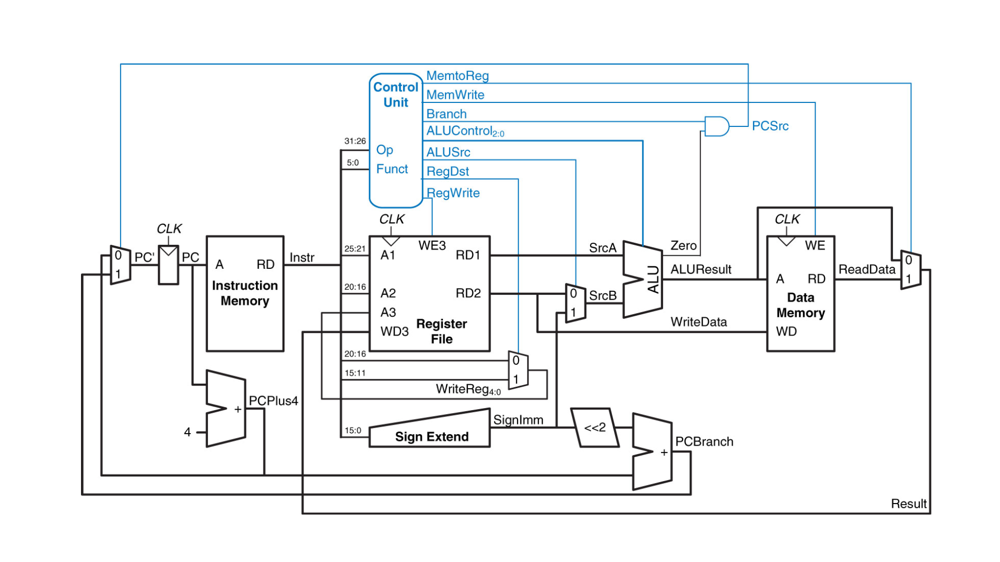

# General Questions

For the next two questions,
consider the MIPS microarchitecture diagram from lecture,
reproduced below.
(This image comes from your textbook.)

7. The diagram as shown does not actually work for `sll` (shift left logical).
Why not?
Describe briefly what you would need to do to add the ability to perform `sll`
with the circuit.

8. Describe the purpose of the AND gate in the upper right part of the diagram
and how it accomplishes that purpose.
Note that I'm not asking how an AND gate works --
what problem does the gate solve for the circuit as a whole?

9. Open up the
[assembly and memory handout](/misc/assembly-and-memory.pdf)
and work through as much as you can.
